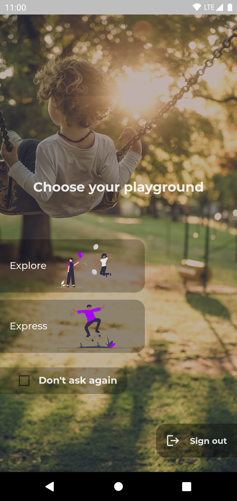

# Choosing Your Playground

There are two playgrounds, *or user modes*, on Apogee Playground: [Express](#express) and [Explore](#explore). You can choose your playground any time, or every time you open the app.

??? example "Tutorial"

    

## Express

If you would like to express yourself and do what you love/feel like to earn money, this is your playground. People who are interested in what you are doing (your expression) will be paying to spend time with you. You will be able to find and connect with people with the same interests.

???+ question "No ideas?"

    Try asking yourself: **"What are the things that make me lose the track of time?"**. If you are still unsure, you can try the [Explore](#explore) playground to get more ideas.

    You can also follow us on [Instagram](https://www.instagram.com/playapogee/){:target="_blank"} to explore more ideas.

[:fontawesome-solid-chevron-right: Getting started with Expressing Yourself](Expressing_Yourself/index.en.md){ .md-button .md-button--primary }

## Explore

If you are looking to find interesting people or people who can help you in any way, this is your playground. You will be paying people on an hourly basis.

[:fontawesome-solid-chevron-right: Getting started with Exploring Expressions](Exploring_Expressions/index.en.md){ .md-button .md-button--primary }

## Changing Your Playground

Unless you have disabled "Choose Playground" (Learn more below: [Disabling The "Choose Playground" Prompt](#disabling-the-choose-playground-prompt)), you can always change your playground when the app starts, or when you [sign in](signin.en.md).

**If you are currently in the app, please follow the following steps:**

1. If you are not on the home screen of the app, please navigate there using the :material-arrow-left: button on the top-left corner of the screen, or by tapping the back button of your device
2. Once you are on the home screen, tap the :material-menu: button on the top-left corner of the screen to open the menu
3. Tap on the **"Switch mode"** button
4. Choose your playground

??? example "Tutorial"

    <figure class="video_container">
    <video width="100%" controls="true" autoplay="true" loop="true" allowfullscreen="true">
        <source src="/videos/change-playground.mp4" type="video/mp4">
    </video>
    </figure>

## Disabling The "Choose Playground" Prompt

You can disable the *"Choose Playground"* screen by checking the **":material-checkbox-marked: Don't ask again"** box at the bottom of the *"Choose Playground"* screen.

??? example "Tutorial"

    <figure class="video_container">
    <video width="100%" controls="true" autoplay="true" loop="true" allowfullscreen="true">
        <source src="/videos/disable-choose-playground-prompt.mp4" type="video/mp4">
    </video>
    </figure>
